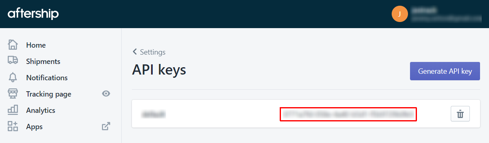

# alexa-aftership

Unofficial Alexa Skill for AfterShip Shipment Tracking Platform

## Disclaimer

**The is an unofficial skill meaning it should only be used for personal usage. I do not have any affiliations with AfterShip or Amazon.**

## Introduction

This skill provides package tracking information using the AfterShip shipment tracking platform API. The information provided is location-aware based on the Echo device configured location country and postal code. All of the location information is normalized via the Google Maps Geocoding API.

It is leveraging the Alexa Skills Kit Command Line Interface (ASK CLI) to streamline the deployment process.

## Prerequisites

You need an [AWS account](https://aws.amazon.com) and an [Amazon developer account](https://developer.amazon.com) to create an Alexa Skill.

In order to use the ASK CLI features to automatically deploy and manage your Lambda skill, ensure that you have AWS credentials set up with the appropriate permissions on the computer to which you are installing ASK CLI, as described in [Set Up Credentials for an Amazon Web Services (AWS) Account](https://developer.amazon.com/docs/smapi/set-up-credentials-for-an-amazon-web-services-account.html).

Once you have installed [ASK CLI](https://developer.amazon.com/docs/smapi/quick-start-alexa-skills-kit-command-line-interface.html), you need to initialize it:

You will need to install the custom [ASK CLI](https://developer.amazon.com/docs/smapi/quick-start-alexa-skills-kit-command-line-interface.html) from my repository until this [PR](https://github.com/alexa/ask-cli/pull/414) is merged, and then initialize it:

```
$ npm install -g jsetton/ask-cli
$ ask init
```

## Credentials

### AfterShip

It is important to note that AfterShip has moved the tracking API functionality behind a paywall. That functionality requires at least the Essentials plan unless your existing account was migrated to the legacy Starter plan.

To get tracking information, you need to generate a [AfterShip API Key](https://admin.aftership.com/settings/api-keys) associated to your account.



### Google Maps

Access to Google Maps API requires to setup a key. This access is necessary for the skill location features. The total number of requests for this skill should easily be covered by the free tier level. To set this up, please follow these instructions:

1. Create a project or use an existing one on your [Google Cloud Resource Manager Console](https://console.cloud.google.com/cloud-resource-manager). If this is your first time using this service, you will be prompted to setup your account by agreeing to Google Cloud Platform's terms and conditions and provide billing information.

    

2. Once the project is selected, enable the [Google Maps Geocoding API](https://console.cloud.google.com/apis/library/geocoding-backend.googleapis.com) and [Google Maps Time Zone API](https://console.cloud.google.com/apis/library/timezone-backend.googleapis.com) services.

     

3. Create an [API key credentials](https://console.cloud.google.com/apis/credentials) by clicking the "Create credentials" blue button and selecting "API key" from the dropdown menu.

    

    The new API key created will show in a popup window as displayed below. Click on the restrict button to customize it.

    

    In the key restrictions section, add the two APIs services enabled above in the API restrictions tab. Unfortunately, there isn't much that can be done to restrict the key even at the application level though Google is strongly recommending to do so.

    

## Deployment

1. Configure the deployment parameters in [`ask-resources.json`](ask-resources.json):
    * Required Parameters
        | Parameter | Description |
        |-----------|-------------|
        | `AfterShipApiKey` | Your AfterShip API key. |
        | `GoogleMapsApiKey` | Your Google Maps API key. |

    * Optional Parameters
        | Parameter | Description |
        |-----------|-------------|
        | `LambdaDebug` | Set to `true` to enable debug mode |
        | `LocationDefaultCountry` | Set your country if not located in the *United States*. |
        | `LocationDefaultTimezone` | Set your [time zone TZ name](https://en.wikipedia.org/wiki/List_of_tz_database_time_zones) if not located in the *US/Eastern* time zone. |
        | `AfterShipDaysPastDelivered` | Number of days since delivered packages are still included in results. (Default: 1) |
        | `AfterShipDaysSearch` | Number of days since tracking created search query limit. AfterShip only stores data up to 90 days. (Default: 30) |
        | `AfterShipNoteTagging` | Filter tracking items based on specific tag(s) part of the AfterShip note field. This can be a regexp. (Default: *disabled*) |
        | `AfterShipTrackingCountLimit` | Maximum number of tracking items returned per query. (Default: 20) |
        | `NotificationMuteFootnotes` | Mute skill location related error notifications at the end of the speech output. (Default: *disabled*) |
        | `NotificationScheduleRate` | Proactive event notification check schedule rate in minutes. (Default: 30) |

2. Deploy the skill and all AWS resources in one step:
    ```
    $ ask deploy
    Deploy configuration loaded from ask-resources.json
    Deploy project for profile [default]

    ==================== Deploy Skill Metadata ====================
    Skill package deployed successfully.
    Skill ID: <skillId>

    ==================== Build Skill Code ====================
    Skill code built successfully.
    Code for region default built to <skillPath>/.ask/lambda/build.zip successfully with build flow NodeJsNpmBuildFlow.

    ==================== Deploy Skill Infrastructure ====================
    ✔ Deploy Alexa skill infrastructure for region "default"
    The api endpoints of skill.json have been updated from the skill infrastructure deploy results.
    Skill infrastructures deployed successfully through @ask-cli/cfn-deployer.

    ==================== Enable Skill ====================
    Skill is enabled successfully.
    ```

3. In your [Alexa Skill Console](https://alexa.amazon.com/spa/index.html#skills/your-skills), find the AfterShip skill under the "Dev Skills" tab and make sure that the Device Country and Postal Code, and Alexa Notifications permissions are enabled as shown below.

    

4. That should be it! Now, just say to your favorite Echo device: "*Alexa, ask aftership where's my stuff*". If you have any errors, please check the [lambda function logs](https://console.aws.amazon.com/cloudwatch/home?region=us-east-1#logStream:group=/aws/lambda/ask-custom-alexa-aftership-default). If necessary, you can enable the function debug mode, to increase the log verbosity, by setting the `LambdaDebug` deployment parameter to `true`.
